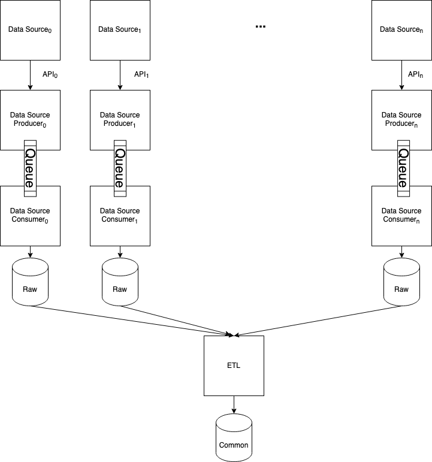

# FRONT introduction

FRONT is a personal system created for capturing all of fitness data across multiple data sources.

FRONT is the abbreviation of

- Fitness (F)
- Route (R)
- Object (O)
- Novel (N)
- Technology (T)
Meaning that it is a bleeding edge solution target for fitness activities and their routes (Run, Walk, Bike etc). The abbreviation may keeps changing as I ran out of idea to be edgy.

## Motivation

I use multiple applications to record my fitness data. Over the past I have ran into MapMyFitness, Nike Fitness Club and, recently, Strava. Realizing the fact that all of the information are spread across different platforms, it would be difficult to analyze my overall performance by looking up multiple apps.

## Get your hand dirty

Influenced by the hacker culture back in college, I wrote a [Proof of concept application](http://killvung.github.io/nuxt-front) to display all my walking routes in Austin area. Visitor can look at the heatmap to see the concentrated area display any five of the longest routes on the map. Even it's not something huge, I still have received multiple positive feedbacks from people, so I was quite motivated and decide to push the application to larger scale in which referred to the beginning of this readme

## Goals

My system has 3 main goals:

- Synchronize all my fitness data from all sources (**Data**)
- Analyze and Predict with previous data (**Machine Learning**)
- Display my fitness statistics (**Frontend**)

### Data

This is the high level design of the pipeline for data synchronization. Each data source has a corresponding producer and consumer to request, fetch and receive data through its API and a message broker. That way I can separate the concern between requesting credential, fetching and ingesting data in the pipeline. Afterward, an ETL service would extract raw data from the database, transform them into common form with dedicated format then load into the common database for the frontend.

### Machine Learning

Observing the usefulness of Machine Learning for correlation and prediction. I decided to use my past data achieve some of the tasks below:

- Labelled missing data

  - Not all data sources have the same scheme, so I may as well implement a machine learning model to predict missing fields elevation gained.

- Cluster running intensity

  - Some of my fitness behaviours change rapidly, sometimes I ran very fast or very slow depending on variation. It would be nice if I can cluster the fitness activities into groups to observe the pattern in between...

- Routes generation

  - Given sequence model predicts data with order, what if I train a LSTM model with my running routes then sampling out from it.

Without too much details. There would be a Machine Learning pipeline in the system that performs the tasks in general:

- Prepare data
  - All the data should be ingested through the data pipeline mentioned above, and be ready to load into this pipeline.
- Build and Train Model
  - Depending on the situation, I may need to use both Traditional Machine Learning or Deep Learning approach to build my model.
- Evaluation and Tests
- Deploy
  - Github repo may not be able to afford the file if the model gets bigger, so I would push to any object storage like S3, Google Drive.

## Frontend

JAM stack plays an important role here, given it's costly to host a server for a long run, so I would rather use Next.JS to prebuild with the data then generate the frontend page in React, then deploy as a static page.
